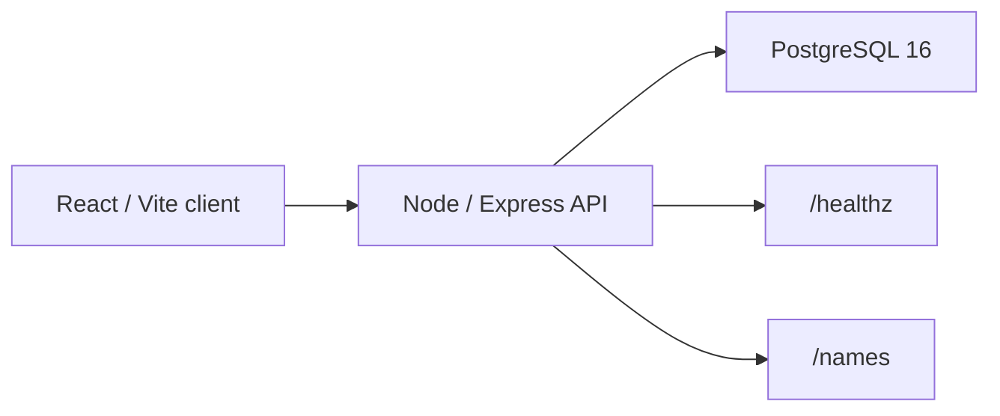

# Job Application Tracker — PoC

Dockerized stack:
- **db**: PostgreSQL 16
- **server**: Node/Express API
- **client**: React (Vite) served by Nginx

## Proof Snapshot

| Signal | Current evidence |
|---|---|
| Stack | Dockerized PostgreSQL 16 database, Node/Express API, and React/Vite client served by Nginx. |
| Local run path | `docker compose up -d` starts database, server, and client services. |
| API surface | Express exposes `/healthz`, `GET /names`, and `POST /names` for a minimal persistence workflow. |
| Database proof | PostgreSQL stores submitted names in `app.names` and can be inspected inside the container. |
| Project role | Early full-stack persistence PoC that supports later job-operations workflow work. |

## What This Proves

- The repo shows the smallest working Dockerized full-stack path: client, API, database, and persistence check.
- It is a support project, not a flagship AI/ML repo; keep it public only as backend/full-stack evidence.
- The evidence maps to backend fundamentals, Docker, PostgreSQL, Express, React, and API workflow roles.

## Architecture

## Run
    docker compose up -d

Open:
- Client: http://localhost:5173
- API:    http://localhost:3000

## API
- GET /healthz
- GET /names
- POST /names   body: {"full_name":"Sathwik"}

## DB
Connect inside container:
    docker exec -it jobtracker_db psql -U postgres -d appdb
Then:
    SELECT * FROM app.names;
